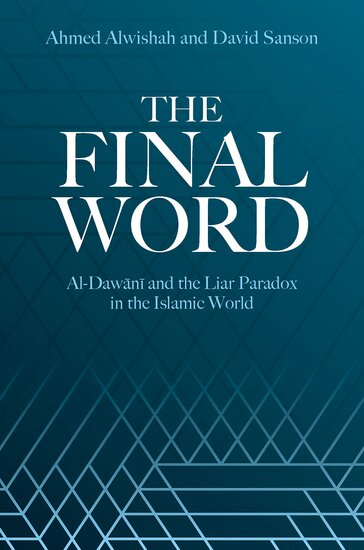

:::{#about-me}

I am an associate professor in the [Philosophy Department] at [Illinois State University].

I have research interests in metaphysics, philosophy of language, the history
of logic, medieval philosophy, and the philosophy of art. I have published
work on the history of the Liar Paradox, time and change, essence and
modality, and the ontological status of fictional characters.

[Ahmed Alwishah] and I have published a book on the history of the Liar 
Paradox, *The Final Word: al-Dawānī and the Liar Paradox in the Islamic World*.
You can read the first 20 pages or so for free on [Google Books].
You can find it in a library using [WorldCat].
You can buy it from [Oxford University Press], [Bookshop.org], [Barnes & Noble], or [Amazon].

{.lightbox fig-alt="Cover of our book, The Final Word" fig-align="center" width=15em}

We also have [an entry on the topic][SEP] forthcoming in the *[Stanford Encyclopedia of Philosophy]*.

| 341 Stevenson Hall
| Department of Philosophy (4540)
| Illinois State University
| Normal, IL 61790

:::

  [Illinois State University]: http://illinoisstate.edu
  [Philosophy Department]: http://philosophy.illinoisstate.edu
  [Ahmed Alwishah]: https://www.pitzer.edu/ahmed-alwishah
  [Google Books]: https://www.google.com/books/edition/The_Final_Word/bl2m0QEACAAJ
  [Oxford University Press]: https://global.oup.com/academic/product/the-final-word-9780197609941
  [Amazon]: https://www.amazon.com/Final-Word-al-Dawani-Paradox-Islamic/dp/0197609945
  [Bookshop.org]: https://bookshop.org/p/books/the-final-word-al-dawani-and-the-liar-paradox-in-the-islamic-world-associate-professor-of-philosophy-david-sanson/40159cb5696aae38
  [Barnes & Noble]: https://www.barnesandnoble.com/w/the-final-word-ahmed-alwishah/1148562805
  [WorldCat]: https://search.worldcat.org/title/The-final-word-:-al-Dawani-and-the-Liar-Paradox-in-the-Islamic-world/oclc/1551490690
  [Stanford Encyclopedia of Philosophy]: https://plato.stanford.edu
  [SEP]: papers/the_liar_paradox_in_the_islamic_world.html

